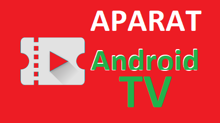
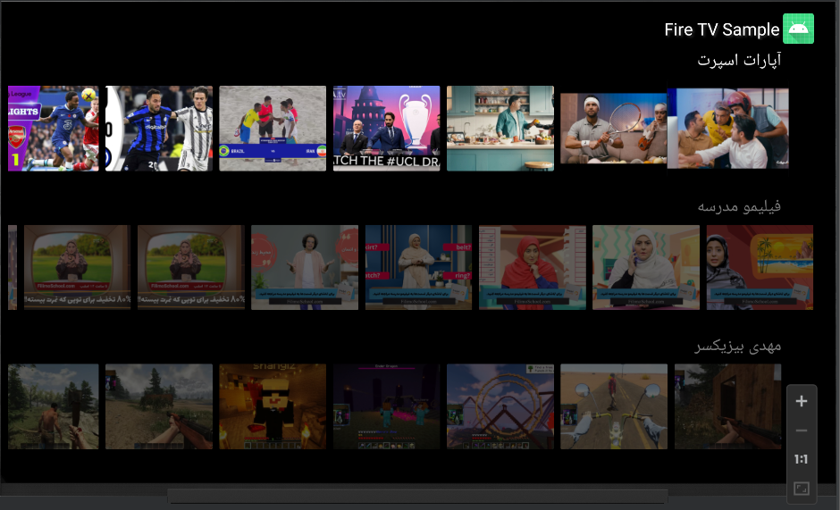

  
  <h1>Aparat TV sample</h1>
  
  

    A Android Project powerd by Leanback library for android TV 
  

  
  

   
<h4>
    <a href="sample/apks/app-debug-sample.apk">View Demo</a>
   · 
     </h4>

 

<!-- About the Project -->
## :star2: About the Project

<!-- Screenshots -->
### :camera: Screenshots

 
  

<!-- TechStack -->
### :space_invader: Main Features

  
Artitecture

  <ul>
    <li><a href="https://developer.android.com/topic/architecture?gclid=Cj0KCQiApb2bBhDYARIsAChHC9swbdWWxEPy_3vWTDNXA4uvie1ZTWnz0RcgXlGGwaaHrhtJNnFZ3wMaAnHjEALw_wcB&gclsrc=aw.ds">MVVM</a></li>
    <li><a href="https://oozou.com/blog/reasons-to-use-android-single-activity-architecture-with-navigation-component-36">Single Activity</a></li>
  </ul>

  
Language

  <ul>
    <li><a href="https://kotlinlang.org/">Kotlin</a></li>
    
  </ul>

API

  <ul>
    <li><a href="https://www.aparat.com/api/fa/v1/video/video/list/tagid/1/">Aparat</a></li>

  </ul>

Some Other

  <ul>
    <li><a href="https://developer.android.com/training/dependency-injection/hilt-android/">Hilt (dependency Injection)</a></li>
    <li><a href="https://square.github.io/retrofit/">Retrofit (wrapper of Okhttp Networking)</a></li>
    <li><a href="https://developer.android.com/guide/navigation?gclid=Cj0KCQiApb2bBhDYARIsAChHC9u-YsH-Wai-RytT_a3KJE4x8_Ej_g8WsmHjuZyqbVTESNi5FK2nVJQaAgQAEALw_wcB&gclsrc=aw.ds">Navigation System</a></li>
    <li><a href="https://developer.android.com/kotlin/flow">Corotinus Flow (react programming)</a></li>
    <li><a href="https://developer.android.com/kotlin/flow">live data (lifecycle of fragments)</a></li>
    <li><a href="io.coil-kt:coil:1.4.0">Coil (ImageLoading)</a></li>
  </ul>

<!-- practice -->
## :dart: practices

* [x] Adding "Fire TV Sample" title
* [x] Adding custom Image on Top view
* [x] collapse and expand Appbar Tilte when scrolling in Home
* [x] Manage Visibility of AppBar in Fragments (Invisible in Splash Screen)
* [x] Adding Set On Click fo items
* [x] implementing a Recycler View ( You can check the log by tag 'home_recycler' to recognize on bind and recyceling)
* [x] Adding Persian Font in whole Project 
* [x] Hide Side Menu
* [x] customize Row categories
* [x] do each tasks on a separate git commit 

<!-- todos -->
### :compass: ToDo Roadmap

- Offline First
  + using Room or other ORM to have caching system which can pereformed offline first Data from Repository
  
- Modular Programming
  + refactoring codes and use Modular Programming to handle in larg scal 
  + and also impelemt difrent UI and senario for both TV and Moblie app
   
- Migrate to MVI Artitecture
  + migrate from MVVM artitecture to MVI to solve uni directnal data flow and have more sutable for testing
  
- Write More Unit Test
  + just implement some few unit test to show but it is more adviced to wrte more Unit test
  
- Write Some Mid Test and UI Test
  + you can write some integration Tests and Ui Tests to reliable whole system
  
- Adding Jetpac Compose
  + using jetpac Compose to have better and fluent data change fo mobile app instead of XML
   

<!-- Acknowledgments -->
## :gem: Preview

you can find the output apk file in below url :

 - [AparatTv.apk](https://github.com/MOSTAFA-IMANI/aparat-tv-sampel/blob/master/sample/apks/app-debug-sample.apk)

<!-- Contributing -->
## :wave: Contributing

Contributions are always welcome!

<!-- Contact -->
## :handshake: Contact

Mostafa Imani - [Linkdin](https://www.linkedin.com/in/mostafa-imani/) - imani.mostafa.74@gmail.com

